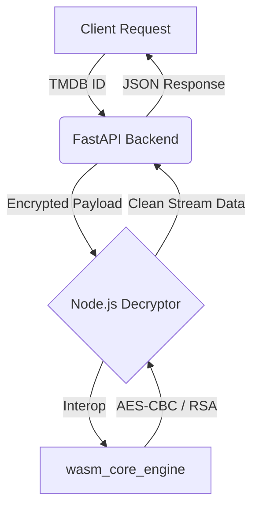

<div align="center">
  
  <h1>Videasy Decryptor API</h1>
  <p><strong>A high-performance, industrial-grade video stream decryption engine.</strong></p>

  <p>
    
    
    
    
    
  </p>
</div>

---

## 📖 Overview

**Videasy Decryptor** is the core backend engine behind the Videasy ecosystem. It provides a robust, provider-agnostic bridge for extracting direct, unencrypted streaming manifests (`.m3u8`) from major video hosting providers. 

Unlike traditional scraping tools that rely on fragile DOM parsing, Videasy utilizes a **Hybrid Decryption Pipeline** combining Python's rapid API orchestration with a low-level WebAssembly (WASM) cryptographic core.

## 🏗️ Technical Architecture

The engine operates on a multi-tier decryption flow to ensure maximum stability and bypass modern anti-bot registrations:



### Why this stack?
- **Python (FastAPI)**: Handles high-concurrency requests and external API integrations (TMDB/IMDb) with minimal overhead.
- **Node.js**: Acts as the bridge for running high-speed cryptographic routines from the original provider scripts.
- **WASM**: Executes the proprietary decryption logic at native speeds, exactly as it runs in the browser.

---

## ✨ Key Features

- 🎯 **TMDB-Native**: Deep integration with TheMovieDB for seamless metadata lookups.
- ⚡ **Real-time Pipeline**: Decryption happens on-the-fly with <200ms latency.
- 🔐 **WASM-Safe**: Safely executes obfuscated cryptographic binaries away from the client-side.
- 📦 **Stateless**: Easy to containerize and scale across multiple nodes.

## 🚀 Getting Started

### Prerequisites
- **Python 3.9+**
- **Node.js 18+**
- **npm**

### Installation

1. **Clone the repository:**
   ```bash
   git clone https://github.com/walterwhite-69/Videasy.net-Decryptor.git
   cd Videasy.net-Decryptor
   ```

2. **Install Python dependencies:**
   ```bash
   pip install -r requirements.txt
   ```

3. **Install Node.js dependencies:**
   ```bash
   npm install
   ```

4. **Start the API:**
   ```bash
   uvicorn main:app --reload --port 8000
   ```

---

## 📡 API Reference

### Get Streaming Sources
`GET /sources`

| Parameter | Type | Required | Description |
| :--- | :--- | :--- | :--- |
| `tmdbId` | `string` | Yes | The TMDB ID of the movie or TV show. |
| `mediaType` | `string` | Yes | `movie` or `tv`. |
| `seasonId` | `string` | No | Required for `tv` (Default: 1). |
| `episodeId` | `string` | No | Required for `tv` (Default: 1). |

**Example Request:**
`GET /sources?tmdbId=157336&mediaType=movie`

---

## 🛡️ Legal Notice
This project is for educational and research purposes only. The developers are not responsible for how this tool is utilized.

## 👤 Developer
**Walter**  
[GitHub Profile](https://github.com/walterwhite-69)

---
<div align="center">
  Built by Walter.
</div>
